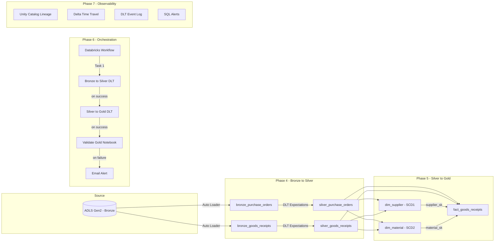
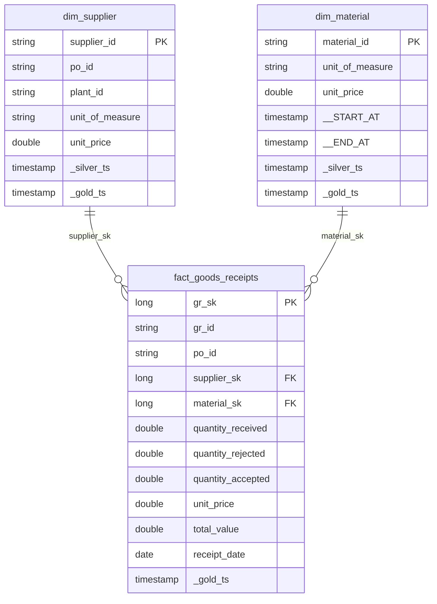

# Manufacturing Supply Chain Analytics

End-to-end data engineering pipeline on **Azure Databricks** — ingesting raw procurement data from ADLS Gen2, transforming it through a medallion architecture, and delivering a production-grade star schema with SCD Type 2 history tracking.

- **Domain:** Procurement — Purchase Orders & Goods Receipts
- **Volume:** 10,000+ records
- **Catalog:** `procurement_db` · schemas: `bronze` · `silver` · `gold`

## Architecture



## Star Schema - Gold Layer



## Project Structure

```
├── phase4/                         # Bronze → Silver (DLT)
│   ├── 04_bronze_to_silver.py      # Auto Loader + quality expectations
│   └── screenshots/
├── phase5/                         # Silver → Gold (Star Schema)
│   ├── 05_silver_to_gold.py        # SCD Type 1/2 + fact table
│   └── screenshots/
├── phase6/                         # Orchestration & Scheduling
│   ├── 06_validate_gold.py         # Post-pipeline validation gate
│   └── screenshots/
└── phase7/                         # Lineage & Observability
    └── screenshots/
```

## Tech Stack

| Component | Technology |
|-----------|-----------|
| Cloud | Microsoft Azure |
| Storage | ADLS Gen2 (Bronze container) |
| Compute | Azure Databricks |
| Ingestion | Auto Loader (cloudFiles) |
| Transformation | Delta Live Tables (DLT) |
| Data Quality | DLT Expectations (expect, expect_or_drop) |
| SCD Handling | `dlt.apply_changes()` — Type 1 & Type 2 |
| Catalog | Unity Catalog (procurement_db) |
| Orchestration | Databricks Workflows (3-task DAG) |
| Scheduling | Quartz Cron — daily 2:00 AM IST |
| Alerting | SQL Alerts + email notifications |
| Governance | Column-level lineage, Delta time travel |

## Key Highlights

- **22K+ goods receipts** and **28K+ purchase orders** processed through quality gates
- **SCD Type 2** on `dim_material` — full history with `__START_AT` / `__END_AT` versioning
- **Zero NULL surrogate keys** — validated via automated checks
- **37 Delta versions** tracked with time travel capability
- **Automated failure detection** — validation notebook blocks bad data from reaching Gold

## Phases

| Phase | Focus | Notebook |
|-------|-------|----------|
| 4 | Bronze → Silver ingestion + cleansing | `04_bronze_to_silver.py` |
| 5 | Silver → Gold star schema + SCD | `05_silver_to_gold.py` |
| 6 | Workflow orchestration + scheduling | `06_validate_gold.py` |
| 7 | Lineage, time travel, observability | — |

---

*Built as part of the AiSPRY Data Engineering Program.*
